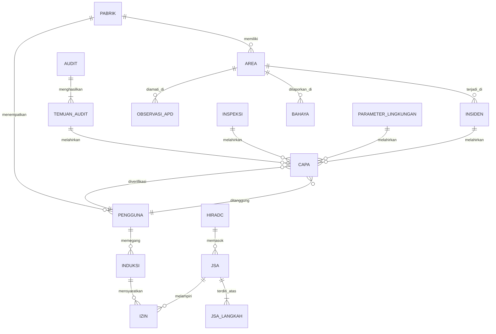

# 05 · Model data

Atribut di bawah diambil dari struktur purwarupa yang sudah berjalan, lalu
dilengkapi hal-hal yang hanya diperlukan sistem produksi: kunci, relasi, jejak
audit, dan cakupan pabrik.

## Ketentuan umum

| Hal | Ketentuan |
|---|---|
| Kunci utama | UUID v4, bukan nomor urut. Nomor yang dilihat pengguna adalah atribut terpisah |
| Nomor tampil | Dibangkitkan peladen, tidak pernah oleh klien. Format pada tabel penomoran di bawah |
| Waktu | Disimpan UTC, ditampilkan WIB. Kolom `dibuat_pada`, `diubah_pada` wajib di setiap tabel |
| Pelaku | Kolom `dibuat_oleh`, `diubah_oleh` berisi id pengguna, wajib di setiap tabel |
| Cakupan | Kolom `pabrik_id` wajib pada setiap tabel transaksi; dipakai menegakkan cakupan data |
| Penghapusan | Tidak ada penghapusan fisik pada tabel transaksi. Kolom `dihapus_pada` menandai penghapusan lunak |
| Lampiran | Berkas dan foto disimpan pada penyimpanan objek; basis data hanya menyimpan rujukannya |

## Penomoran

| Entitas | Format | Contoh |
|---|---|---|
| Insiden | `INC-<tahun>-<urut 4>` | `INC-2026-0318` |
| Laporan bahaya | `HZ-<tahun>-<urut 4>` | `HZ-2026-0451` |
| Inspeksi | `INS-<tahun>-<urut 4>` | `INS-2026-0072` |
| Checklist harian | `CHK-<tahun>-<urut 4>` | `CHK-2026-1841` |
| Izin kerja | `WP-<tahun>-<urut 4>` | `WP-2026-0913` |
| JSA | `JSA-<tahun>-<urut 3>` | `JSA-2026-011` |
| HIRADC | `HRD-<urut 3>` | `HRD-007` |
| Risiko | `RSK-<urut 3>` | `RSK-004` |
| CAPA | `CAPA-<tahun>-<urut 4>` | `CAPA-2026-0142` |
| Audit | `AUD-<tahun>-<urut 3>` | `AUD-2026-004` |
| Temuan audit | `TMN-<tahun>-<urut 3>` | `TMN-2026-011` |
| Induksi | `IND-<tahun>-<urut 4>` | `IND-2026-0088` |
| Regulasi | `REG-<urut 3>` | `REG-012` |
| Observasi APD | `APD-<tahun>-<urut 4>` | `APD-2026-0142` |
| Observasi perilaku | `OBS-<tahun>-<urut 4>` | `OBS-2026-0233` |

### Penomoran kiriman lapangan

Kiriman dari aplikasi lapangan memakai awalan berbeda sampai diverifikasi
(AB-05). Setelah verifikasi, catatan menerima nomor tetap dari daftar di atas,
dan nomor lapangan disimpan sebagai `nomor_asal`.

| Jenis | Awalan sementara |
|---|---|
| Bahaya | `HZ-L-<urut 4>` |
| Insiden | `INC-L-<urut 4>` |
| Observasi perilaku | `OBS-L-<urut 4>` |
| Observasi APD | `APD-L-<urut 4>` |
| Pengajuan izin | `WP-L-<urut 4>` |

## Entitas acuan

Data acuan dikelola Administrator Sistem dan tidak ditulis tetap di kode.

| Entitas | Atribut pokok |
|---|---|
| `pabrik` | nama, kode, alamat, jumlah pekerja, aktif |
| `area` | pabrik_id, nama, urutan, aktif |
| `pengguna` | email, nama, inisial, peran, pabrik_id, status, masuk_terakhir |
| `peran` | kode, nama, daftar modul, tingkat kewenangan per modul |
| `jenis_apd` | nama, wajib_di_area[] |
| `kategori_bahaya` | nama (Fisik, Kimia, Mekanik, Listrik, Ergonomi, Biologi, Psikososial) |
| `kategori_observasi` | nama |
| `jenis_izin` | nama, prasyarat[] |
| `elemen_smk3` | nomor, nama, jumlah kriteria |
| `baku_mutu` | parameter, satuan, nilai ambang, acuan regulasi |

## Entitas transaksi

Atribut yang sudah ada pada purwarupa ditandai ✓. Sisanya adalah tambahan yang
hanya diperlukan sistem produksi.

### `insiden`

| Atribut | Jenis | Catatan |
|---|---|---|
| nomor ✓ | teks | Penomoran di atas |
| jenis ✓ | enum | Nearmiss, Incident, Accident |
| keparahan ✓ | enum | Ringan, Sedang, Serius |
| area_id ✓ | rujukan | Menggantikan `lokasi` berupa teks |
| tanggal ✓, waktu ✓ | tanggal, waktu | |
| pelapor_id ✓ | rujukan | Kosong bila anonim |
| anonim | boolean | |
| ringkas ✓, kronologi ✓, dampak ✓ | teks | |
| akar ✓ | teks | Hasil investigasi |
| hari_kerja_hilang | bilangan | Untuk KPI |
| status ✓ | enum | Baru, Investigasi, Menunggu Verifikasi, Selesai |
| nomor_asal | teks | Bila berasal dari kiriman lapangan |

Relasi: `insiden` 1—* `capa` (AB-01), `insiden` 1—* `lampiran`.

### `bahaya`

Atribut purwarupa: nomor ✓, kategori ✓, area ✓, isi ✓, pelapor ✓, waktu ✓,
status ✓, risiko ✓. Tambahan: `anonim`, `koordinat`, `akurasi_m`, `nomor_asal`,
`diverifikasi_oleh`, `diverifikasi_pada`.

### `izin` (work permit)

Atribut purwarupa: nomor ✓, jenis ✓, judul ✓, pelaksana ✓, vendor ✓, pekerja ✓,
pengawas ✓, mulai ✓, status ✓, zona ✓, risiko_awal ✓, risiko_sisa ✓,
prasyarat ✓. Tambahan: `selesai`, `jsa_id` (wajib, AB-09), `disetujui_oleh`,
`disetujui_pada`, `nomor_asal`.

Relasi: `izin` *—1 `jsa`; `izin` *—* `pengguna` sebagai pelaksana.

### `jsa` dan `jsa_langkah`

| `jsa` | `jsa_langkah` |
|---|---|
| nomor ✓, pekerjaan ✓, area ✓, jenis ✓ | jsa_id, nomor urut ✓ |
| penyusun ✓, peninjau ✓, pengesah ✓ | uraian kerja ✓ |
| disusun ✓, disahkan ✓, tinjau ✓, rev ✓ | bahaya ✓ |
| status ✓ (Draf, Menunggu Pengesahan, Disahkan) | kemungkinan awal ✓, keparahan awal ✓ |
| apd_wajib ✓ (daftar) | kemungkinan sisa ✓, keparahan sisa ✓ |
| | pengendalian ✓ (daftar: tingkat hierarki + teks) |

Relasi: `jsa` 1—* `jsa_langkah`; `jsa` 1—* `izin`.

### `hiradc`

Atribut purwarupa: nomor ✓, proses ✓, aktivitas ✓, sifat ✓ (Rutin/Non-rutin/
Darurat), kategori ✓, bahaya ✓, risiko ✓, korban ✓, kemungkinan ✓, keparahan ✓,
kendali_ada ✓, kemungkinan_sisa ✓, keparahan_sisa ✓, kendali_tambahan ✓,
hierarki ✓, penanggung_jawab ✓, target ✓, status ✓.

Skor tidak disimpan; dihitung dari kemungkinan × keparahan (AB-14).

### `capa`

Atribut purwarupa: nomor ✓, judul ✓, sumber ✓, sumber_jenis ✓, penanggung_jawab ✓,
terbit ✓, tenggat ✓, umur ✓, status ✓, prioritas ✓. Tambahan: `sumber_id`
(wajib, AB-01), `bukti_penyelesaian`, `verifikator_id` (AB-17),
`diverifikasi_pada`.

`umur` dihitung, tidak disimpan: hari sejak `terbit` (AB-16).

### `observasi` dan `observasi_apd`

Keduanya **tidak** menyimpan identitas pekerja yang diamati (AB-06).

| `observasi` | `observasi_apd` |
|---|---|
| pengamat_id ✓, area ✓, tanggal ✓ | pengamat_id ✓, area ✓, tanggal ✓ |
| aman ✓, berisiko ✓ | diamati ✓, patuh ✓ |
| kategori ✓, catatan ✓, tindakan ✓ | catatan ✓ |
| | rincian ✓ (per jenis APD: diamati, patuh) |

Pemeriksaan `patuh ≤ diamati` ditegakkan basis data dan API (AB-07).

### `induksi`

Atribut purwarupa: nomor ✓, nama ✓, jenis ✓, asal ✓, tanggal ✓, pemandu ✓,
nilai ✓, berlaku_sampai ✓, status ✓. `sisa` dihitung, tidak disimpan.

`berlaku_sampai` dihitung dari `tanggal` + masa berlaku menurut jenis (AB-23),
dan **kosong bagi peserta yang tidak lulus** — mereka tidak punya kartu sama
sekali, bukan kartu yang kebetulan sudah lewat. Tanggal yang sudah lewat masih
berupa kartu, dan kartu yang pernah ada dapat diperpanjang; yang tidak lulus
harus mengulang induksinya. Batasan `induksi_berlaku_wajib` menutup jalur
sebaliknya: selain berstatus Tidak Lulus, kartu wajib punya masa berlaku,
karena izin kerja membacanya sebagai gerbang (AB-11) dan gerbang tanpa tanggal
selalu terbuka.

### `regulasi`

Atribut purwarupa: nomor ✓, nomor_peraturan ✓, judul ✓, penerbit ✓, bidang ✓,
pasal ✓, penerapan ✓, bukti ✓, penanggung_jawab ✓, evaluasi ✓, status ✓.

Status dihitung sebagian: baris tanpa `bukti` tidak dapat berstatus Terpenuhi
(AB-22).

### Angka ringkasan tidak disimpan

Jumlah butir, butir terjawab, dan temuan pada `inspeksi` dan `checklist`
dihitung dari tabel butirnya. Jumlah temuan Major, Minor, dan Observasi pada
`audit` dihitung dari `temuan_audit`. Tidak satu pun disimpan sebagai kolom.

Angka ringkasan yang disimpan selalu berakhir menyimpang dari rinciannya, dan
yang dipercaya orang justru angka ringkasannya.

> **Pertentangan purwarupa.** Kepala audit AUD-2026-003 pada purwarupa menyebut
> 1 Major, 6 Minor, dan 9 Observasi, sedangkan daftar temuannya hanya memuat
> empat baris. Angka yang dihitung sistem karena itu berbeda dari angka yang
> tertulis di purwarupa. Yang benar adalah memasukkan temuan yang sungguhan;
> angkanya akan menyesuaikan sendiri.

### Entitas lain

`inspeksi`, `checklist_harian`, `audit`, `temuan_audit`, `risiko`,
`dokumen_internal`, `dokumen_eksternal`, `pelatihan`, `sertifikasi`,
`kegiatan`, `notifikasi`, `parameter_lingkungan` mengikuti atribut purwarupa
ditambah kolom umum (`pabrik_id`, jejak audit, penghapusan lunak).

## Hubungan pokok

Empat relasi yang menegakkan aturan bisnis:

| Relasi | Aturan |
|---|---|
| `capa.sumber_id` wajib | AB-01 — CAPA selalu punya induk |
| `izin.jsa_id` wajib dan JSA berstatus Disahkan | AB-09 |
| `izin` ← `induksi` pemegang masih berlaku | AB-11 |
| `capa.verifikator_id ≠ capa.penanggung_jawab_id` | AB-17 |

## Jejak audit

Tabel `jejak_audit` menyimpan setiap perubahan pada tabel transaksi dan tabel
acuan.

| Kolom | Isi |
|---|---|
| `id` | UUID |
| `tabel`, `baris_id` | Sasaran perubahan |
| `aksi` | buat, ubah, hapus_lunak, verifikasi |
| `nilai_sebelum`, `nilai_sesudah` | JSON, hanya kolom yang berubah |
| `pengguna_id`, `waktu`, `alamat_ip` | Pelaku |

Baris `jejak_audit` tidak dapat diubah atau dihapus lewat antarmuka mana pun.
Hak `DELETE` dan `UPDATE` pada tabel ini dicabut di tingkat basis data, termasuk
bagi akun aplikasi.

## Retensi

| Data | Masa simpan | Dasar |
|---|---|---|
| Catatan insiden dan CAPA | 5 tahun setelah ditutup | Kebutuhan bukti audit dan ketenagakerjaan |
| Rekaman induksi | 3 tahun setelah kartu berakhir | |
| Foto lampiran | Sama dengan catatan induknya | |
| Jejak audit | 5 tahun | |
| Antrean lapangan di perangkat | Sampai terkirim; foto dipangkas pada 20 terbaru | Keterbatasan penyimpanan peramban |

Masa simpan di atas adalah usulan. Tahap 1 menetapkan angka yang mengikat
setelah ditinjau bersama bagian hukum Khong Guan Group.
