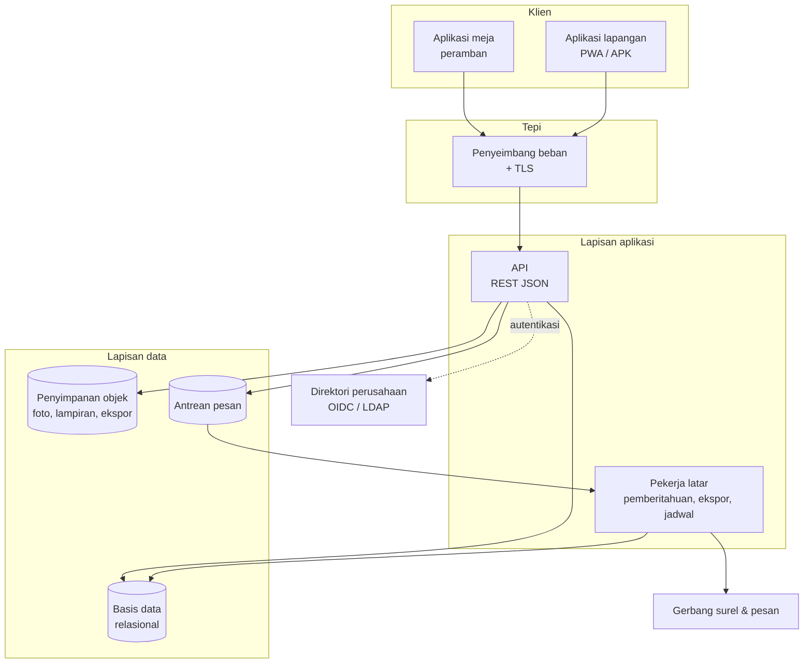

# 07 · Arsitektur teknis

## Keadaan sekarang dan sasaran

| Lapis | Purwarupa hari ini | Sistem produksi |
|---|---|---|
| Antarmuka meja | Aplikasi satu halaman, tanpa tahap build | Tetap dipakai; ditambah pemuatan data dari API |
| Aplikasi lapangan | PWA, dapat dipasang, bekerja luring | Tetap; ditambah sinkronisasi dan APK opsional |
| Data | Berkas contoh di dalam peramban | Basis data relasional dengan jejak audit |
| Peladen | Tidak ada | API terdokumentasi |
| Berkas | Data URI di peramban | Penyimpanan objek |
| Autentikasi | Akun demo di dalam kode | Direktori perusahaan (OIDC/LDAP) |
| Pemberitahuan | Daftar di dalam aplikasi | Surel, pesan, pemberitahuan dorong |
| Pelaporan | Tampilan siap cetak | Ekspor PDF dan Excel |

Antarmuka **tidak** ditulis ulang. Purwarupa yang sudah diuji tetap dipakai;
yang ditambahkan adalah lapisan data di belakangnya.

## Gambaran lapisan

## Pilihan teknologi

Pilihan di bawah adalah usulan. Yang mengikat adalah sifatnya, bukan mereknya —
bila tim TI Khong Guan Group sudah membakukan tumpukan lain, penyesuaian
dilakukan pada tahap 1 tanpa mengubah dokumen lain.

| Lapis | Usulan | Sifat yang mengikat |
|---|---|---|
| Antarmuka | JavaScript tanpa kerangka, seperti purwarupa | Tidak ada tahap build wajib; dapat dibaca tanpa perkakas khusus |
| API | Node.js atau PHP, sesuai kebiasaan tim | Satu proses, tanpa keadaan; dapat digandakan mendatar |
| Basis data | PostgreSQL 15+ | Relasional, transaksional, mendukung JSON untuk jejak audit |
| Penyimpanan objek | S3 atau setara | Terpisah dari basis data; foto tidak pernah masuk kolom biner |
| Antrean | Redis atau tabel antrean | Pekerjaan lambat tidak menahan permintaan pengguna |
| Pemberitahuan dorong | Web Push (VAPID) | Tanpa ketergantungan pada toko aplikasi |

### Mengapa antarmuka tetap tanpa kerangka

Tiga alasan, disebutkan supaya tidak diperdebatkan ulang setiap ada anggota tim
baru:

1. Purwarupa yang sudah diuji tinggal disambungkan, bukan ditulis ulang.
2. Tidak ada tahap build berarti tidak ada rantai pasok yang perlu diamankan
   dan tidak ada versi perkakas yang perlu dijaga selama masa dukungan.
3. Aplikasi lapangan harus berukuran kecil supaya dapat dipasang dan disimpan
   seluruhnya di perangkat lapangan yang penyimpanannya terbatas.

Bila tim Khong Guan Group lebih nyaman dengan kerangka tertentu untuk
pemeliharaan jangka panjang, itu keputusan yang sah dan diambil pada tahap 1,
sebelum penyambungan modul dimulai.

## Lingkungan

| Lingkungan | Tujuan | Data |
|---|---|---|
| Pengembangan | Pekerjaan harian pengembang | Data contoh |
| Uji | Pengujian tim dan UAT | Data contoh + salinan tersamar |
| Produksi | Pemakaian sungguhan | Data sebenarnya |

Data produksi tidak pernah disalin ke lingkungan lain tanpa penyamaran. Nama
pelapor, nomor telepon, dan foto wajah disamarkan pada salinan uji.

## Penempatan

Dua pilihan, keduanya kami kerjakan. Pilihan ini berhubungan dengan kebijakan
data perusahaan, bukan dengan kemampuan sistemnya.

| Pilihan | Kelebihan | Yang perlu disiapkan Khong Guan Group |
|---|---|---|
| Peladen sendiri | Data tidak keluar jaringan perusahaan | Peladen, cadangan, pemantauan, sertifikat TLS |
| Penyedia awan | Cepat disiapkan, cadangan terkelola | Persetujuan kebijakan data keluar |

Apa pun pilihannya, sistem dijalankan sebagai wadah (container) supaya
pemindahan antarlingkungan tidak mengubah cara pemasangannya.

## Ketersediaan dan pemulihan

| Hal | Sasaran |
|---|---|
| Ketersediaan jam kerja (06.00–22.00 WIB) | 99,5% |
| Cadangan basis data | Harian penuh + log berkelanjutan |
| RPO (data yang boleh hilang) | 15 menit |
| RTO (waktu pulih) | 4 jam pada jam kerja |
| Uji pemulihan | Dua kali setahun, hasilnya didokumentasikan |

Cadangan yang tidak pernah diuji pemulihannya bukan cadangan; itu sebabnya uji
pemulihan masuk sebagai kewajiban, bukan anjuran.

## Pemantauan

| Yang dipantau | Ambang tindakan |
|---|---|
| Ketersediaan API | Gagal 3 kali berturut-turut → pemberitahuan |
| Waktu tanggap API persentil 95 | > 1 detik selama 5 menit |
| Antrean pekerjaan latar | > 500 pekerjaan menunggu |
| Kegagalan sinkronisasi lapangan | > 5% kiriman dalam 1 jam |
| Ruang penyimpanan | < 20% tersisa |

Pemantauan kegagalan sinkronisasi lapangan penting karena kegagalannya diam:
pekerja mengira laporannya terkirim, padahal tertahan di perangkat.

## Yang sengaja tidak dipakai

| Hal | Alasan |
|---|---|
| Arsitektur layanan mikro | Beban operasional tidak sepadan untuk sistem satu perusahaan dengan lima peran |
| Basis data NoSQL sebagai penyimpan utama | Data QHSE penuh relasi dan butuh transaksi; jejak audit menuntut konsistensi |
| Penyimpanan foto di dalam basis data | Membengkakkan cadangan dan memperlambat pemulihan |
| Kerangka JavaScript pada aplikasi lapangan | Ukuran unduhan menentukan apakah aplikasi terpasang di perangkat lapangan |
